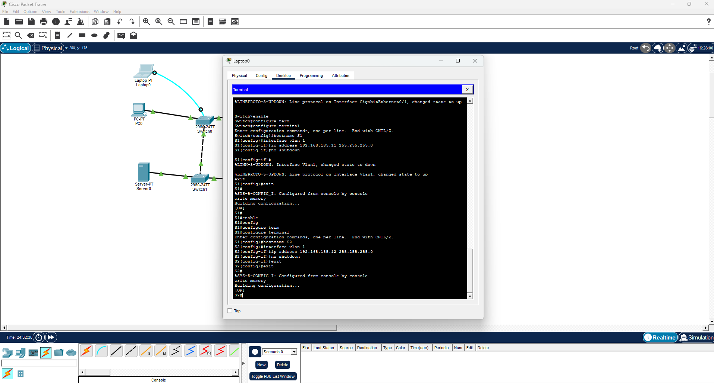
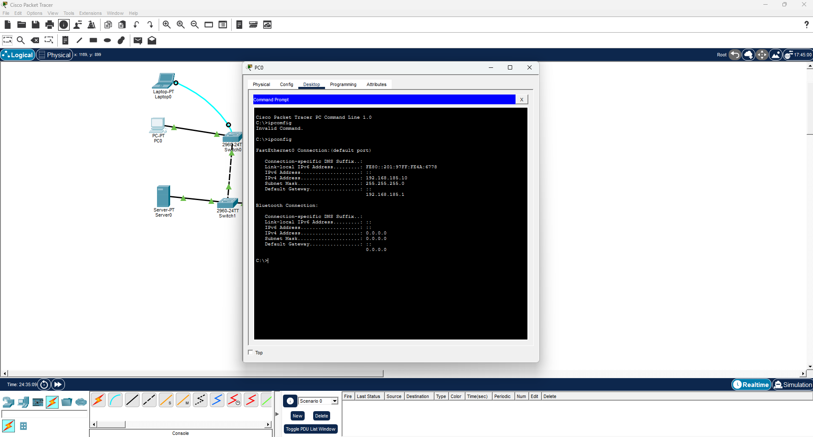
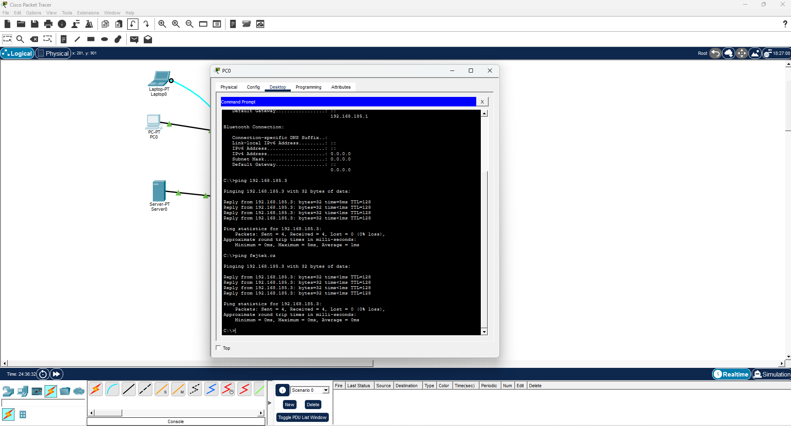
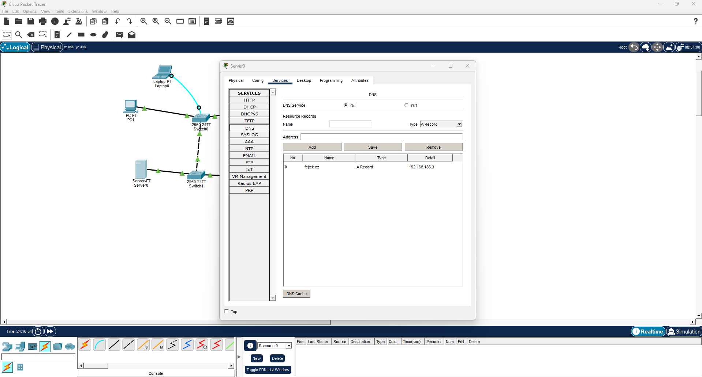
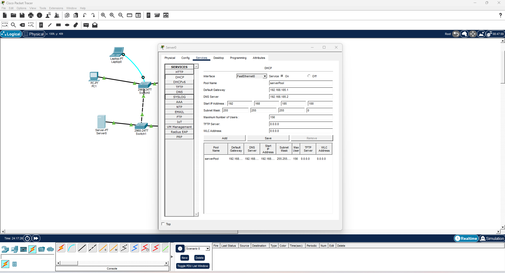
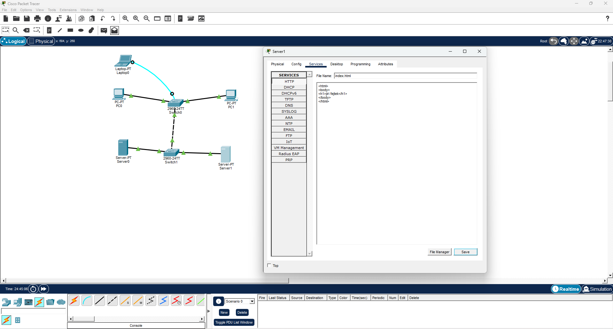

# LAN

## Popis sítě

Rozsah: 192.168.185.0/24
S1: přípojné místo pro PC1, PC2 a Laptop
S2: přípojné místo pro SRV1, SRV2
SRV1: DHCP + DNS (fejtek.cz)
SRV2: WEB server
PC1: statická konfigurace
PC2: dynamická konfigurace přes DHCP

## Výpočet X

F(70) + E(69) + J(74) + T(84) + E(69) + K(75) = 441
441 mod 256 = 185

## Screenshoty

**configurace switche**

**pc1**

**dns dhcp web**

